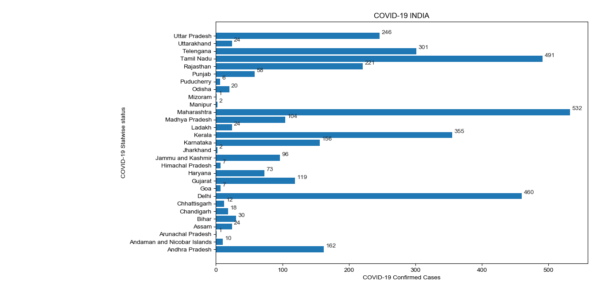

This python script will read the information from https://www.mohfw.gov.in/ site and creat graph.

For now this script is working fine but if any changes happen to the site dashboard this will not work as expected.

Requirements 

install Matplotlib, BeautifulSoup, NumPy and requests packages

Result:

